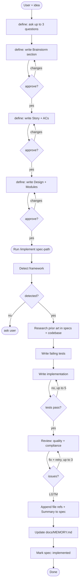

# i-dunno

Spec-driven TDD workflow for Claude Code. Idea goes in, working reviewed documented code comes out.

## Skills

| Skill | Role |
|---|---|
| `/define` | Entry point. Guides idea through brainstorm → spec → design, then hands off to `/implement`. |
| `/implement` | TDD loop. Reads spec, researches prior art, writes failing tests, implements, reviews quality and compliance, wraps up. |
| `/gc` | Maintenance. Prunes stale, duplicate, out-of-scope, and unverifiable entries from `CLAUDE.md` and `docs/` files. |

## Workflow



## Hooks

| Hook | Trigger | Blocks |
|---|---|---|
| `file-guard.sh` | Write / Edit | `.env`, key files, `bin/` writes, out-of-root paths, secret patterns in content |
| `bash-guard.sh` | Bash | `rm -rf`, force push, pipe-to-shell, shell reads of key files |

## Structure

```
docs/
  specs/            — feature specs (status-tracked, workflow-owned)
  MEMORY.md         — decision rationales: why X over Y, never file paths or patterns
  architecture.md   — system-wide structural decisions (hand-maintained, optional)
  design-system.md  — colors, tokens, UI rules (hand-maintained, optional)
```

`CLAUDE.md` — tech stack, folder purposes, and iron-law rules only. Everything else goes in `docs/`.
