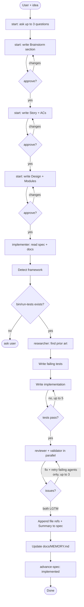

# i-dunno

Spec-driven TDD workflow for Claude Code. Idea goes in, working reviewed documented code comes out.

## Agents

| # | Agent | Role |
|---|---|---|
| 1 | `start` | Entry point. Guides idea through brainstorm → spec → design, then spawns implementer. |
| 2 | `implementer` | Orchestrator. Reads spec, drives TDD loop, spawns all subagents. |
| 3 | `researcher` | Finds prior art in `docs/specs/` and codebase before tests are written. |
| 4 | `reviewer` | Code quality: conventions, security, error handling, test correctness. |
| 5 | `validator` | Feature compliance: AC coverage, spec intent, Architecture and UI sections. |
| — | `gc` | Maintenance: prunes stale/out-of-scope entries from `CLAUDE.md` and all `docs/` reference files. |

## Workflow



## Hooks

| Hook | Trigger | Blocks |
|---|---|---|
| `file-guard.sh` | Write / Edit | `.env`, key files, `bin/` writes, out-of-root paths, secret patterns in content |
| `bash-guard.sh` | Bash | `rm -rf`, force push, pipe-to-shell, shell reads of key files |

## Structure

```
docs/
  specs/            — feature specs (status-tracked, workflow-owned)
  MEMORY.md         — decision rationales: why X over Y, never file paths or patterns
  architecture.md   — system-wide structural decisions (hand-maintained, optional)
  design-system.md  — colors, tokens, UI rules (hand-maintained, optional)
```

`CLAUDE.md` — tech stack, folder purposes, and iron-law rules only. Everything else goes in `docs/`.
