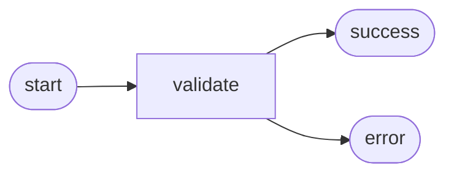

# i-dunno:define

> Speak and write everything in caveman style: terse, no filler, compress aggressively. All responses, all markdown files. Why use many token when few token do trick. Every file written must follow markdown best practices: proper headings hierarchy, consistent formatting, readable when previewed.

All specs live flat in `docs/specs/`. Status tracked in frontmatter `status:` field — never in directory structure.

## New idea

Argument is plain text:

1. Generate a timestamp by running `date +%Y%m%d%H%M%S`
2. Derive a short title (2–4 words) and slug from the argument text (slug: lowercase words joined by underscores, no special characters, max 5 words). Create `docs/specs/TIMESTAMP_slug.md` with this frontmatter:

```markdown
---
title: Derived title
status: brainstorm
refs: []
---
```

3. Continue with the **Brainstorm stage** below

## Existing spec

Argument is a timestamp — run `find docs/specs/ -name "TIMESTAMP*" -type f 2>/dev/null` to locate the file. If nothing returned, tell user no spec found with that timestamp and stop. Read the `status:` field from frontmatter to determine current stage:

| status | Continue with |
|---|---|
| `brainstorm` | **Brainstorm stage** below |
| `spec` | **Spec stage** below |
| `design` | **Design stage** below |
| `implemented` | Tell user done. Offer new spec for changes. |

---

## Brainstorm stage

Caveman: terse, no filler, compress aggressively.

### If `## Brainstorm` already exists in the spec

Show it. Ask to approve or request changes.

- Approved → run `sed -i '' "s|^status: .*|status: spec|" <file-path>`, continue with **Spec stage** below
- Changes → edit in place, ask again

### If `## Brainstorm` is missing

Before writing, ask the user up to three short questions to gather more context. Wait for answers.

Find related specs by running `grep -rlE "KEYWORDS" docs/specs/ --include="*.md" 2>/dev/null` where KEYWORDS is two to four key terms from the idea joined with `|`. For each match, read only the frontmatter title and first paragraph — do not read full files. Do not record open questions — use answers to inform the content only.

Then write the `## Brainstorm` section in the spec file. Keep it short — five to ten lines. No implementation details. Cover the problem, scope, constraints, and any related specs found above.

#### Output format

```markdown
## Brainstorm

Problem. Scope. Constraints.

Related: [title](YYYYMMDDHHMMSS_slug.md)
```

Omit the `Related:` line if no matches found.

Tell user the file path. Ask to approve or request changes.

- Approved → run `sed -i '' "s|^status: .*|status: spec|" <file-path>`, continue with **Spec stage** below
- Changes → edit in place, ask again

---

## Spec stage

Caveman: terse, no filler, compress aggressively.

### If `## Story` already exists in the spec

Show it. Ask to approve or request changes.

- Approved → run `sed -i '' "s|^status: .*|status: design|" <file-path>`, continue with **Design stage** below
- Changes → edit in place, ask again

### If `## Story` is missing

Edit the frontmatter to update the `refs` field with any spec paths found in the `Related` field of the Brainstorm section (YAML inline array of filenames relative to `docs/specs/`). Then append a `## Story` section to the spec file.

Describe behavior from the user's point of view — what it does, not how. Each criterion on one line.

#### Output format

```markdown
---
title: Title
refs: [20260526110000_slug.md, 20260526100000_other.md]
---

## Story

As [role], want [goal], so [benefit].

AC:
1. Acceptance criterion
2. Acceptance criterion
```

Tell user the file path. Ask to approve or request changes.

- Approved → run `sed -i '' "s|^status: .*|status: design|" <file-path>`, continue with **Design stage** below
- Changes → edit in place, ask again

---

## Design stage

Caveman: terse, no filler, compress aggressively.

### If `## Design` already exists in the spec

Show it. Ask to approve or request changes.

- Approved → continue with **Implement stage** below
- Changes → edit in place, ask again

### If `## Design` is missing

Before designing, search for existing files relevant to the spec. Extract key terms (entity names, operations) from the Story section. Run `grep -rl "term" . --exclude-dir=".git"` for each key term to locate relevant existing files. Read the top hits to understand existing patterns.

Then append a `## Design` section to the spec file.

#### Output format

````markdown
## Design

### Flow



### Data

input: { field: type }
output: { field: type }

### Modules

- `path/to/file` — what changes
````

One flow diagram only — happy path + main failure path. Use a `mermaid` fenced code block — renders in GitHub, VS Code, and most Markdown previewers, and scales to complex flows without breaking alignment. Data: key inputs and outputs only. Modules: all files that will be created or modified, including test files.

Tell user the file path. Ask to approve or request changes.

- Approved → continue with **Implement stage** below
- Changes → edit in place, ask again

---

## Implement stage

Tell the user:

```
Design approved. Run:

/implement <spec file path>
```
